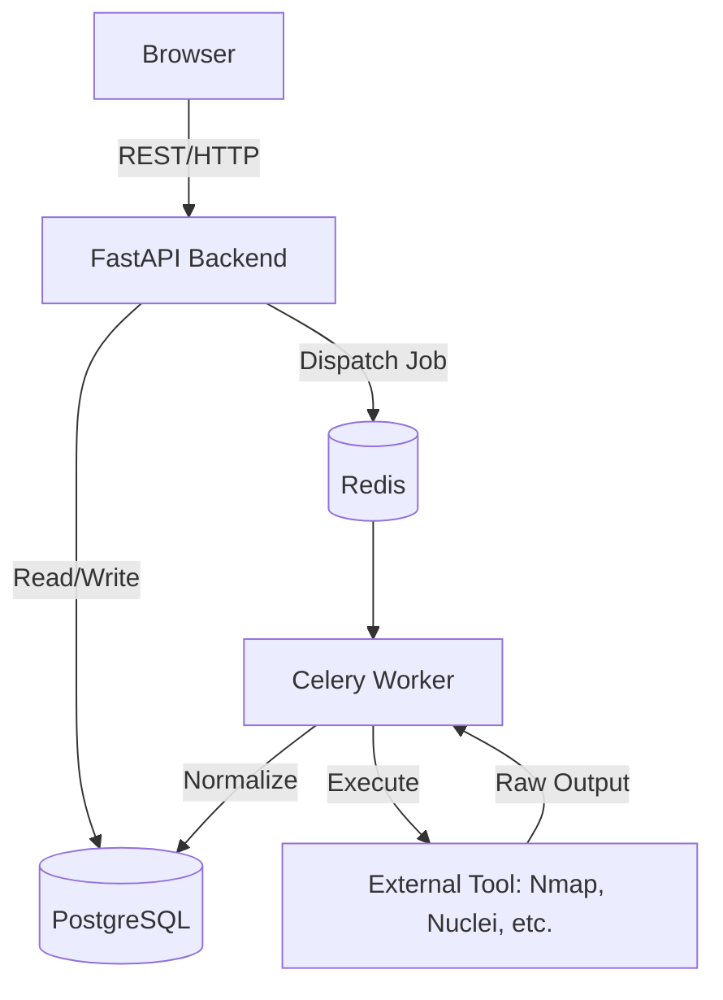

# System Architecture

## Overview
SentinelX follows a modular, async-driven architecture separating the API presentation layer from heavy security scanning workloads.

## Components
1. **Frontend (Next.js):** SSR/SSG capable React application using Tailwind and shadcn/ui.
2. **API Backend (FastAPI):** High-performance Python API handling routing, auth, and DB sessions.
3. **Task Queue (Celery + Redis):** Manages long-running security scans (Nmap, Nuclei) without blocking the API.
4. **Database (PostgreSQL):** Relational store for normalized findings, assets, and configurations.

## Architecture Diagram (Mermaid)

## Security Pipeline
Target -> Subfinder -> Dnsx -> Naabu/Nmap -> Httpx -> Nuclei -> Result Normalization -> DB
